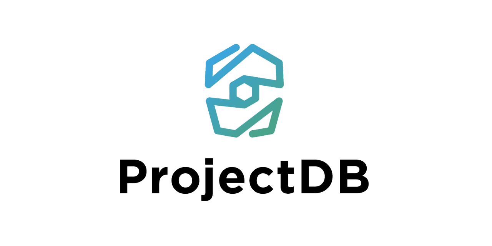

<picture>
  <source media="(prefers-color-scheme: dark)" srcset="docs/images/projectdb-dark.png">
  
</picture>

ProjectDB is a platform for building web applications around your business processes. Use it for a small web server, a specialized microservice, or a complete business system with a website, CRM, client portal and reporting.

Official website: [projectdb.pro](https://projectdb.pro)

[](https://www.npmjs.org/package/projectdb)
[](https://npmcharts.com/compare/projectdb?minimal=true)
[](https://github.com/pavel-elblaus/projectdb/releases/latest)
[](https://github.com/pavel-elblaus/projectdb/blob/master/LICENSE)

Руководство по установке и первому запуску также доступно [на русском языке](README.ru.md).

## What you can build

Start with a website or a single workflow, then add CRM, task management, internal registers and client portals as your needs grow. ProjectDB supports both public-facing applications and the systems your team uses every day.

- **Shared data across applications.** Connect the website, sales pipeline and client portal to the same database. A request submitted online can become a CRM record and appear in the client's account without transferring data between separate products.
- **Processes that match your business.** Define your own entities, forms, statuses, workflows and reports. Reusable components and configuration stored in the database let you change the application without rebuilding it for every configuration update.
- **Live team collaboration.** Shared boards and task views reflect changes made by other users, helping teams work from the same information.
- **Detailed access control.** Assign permissions down to records and fields, separate access administration from day-to-day work, and keep an activity history.
- **Multiple languages and domains.** Run websites and applications for different audiences, with shared data and access rules where needed.
- **Connections to existing services.** Integrate external APIs, databases, email, files and messaging queues; use scheduled jobs to automate recurring work.

ProjectDB is a low-code platform: developers implement business logic, SQL and custom integrations, while much of the application is assembled through configuration. Installing this package prepares the runtime. To run a specific application, connect its database and specify the startup settings. See the [official website](https://projectdb.pro) for examples.

Run applications on Linux or Windows, in a terminal, as a Linux service or through PM2. The server installer handles the initial software setup and can resume interrupted work. The repository code is available under the [MIT License](LICENSE).

## Choose an installation method

| Your environment | Installation method |
| --- | --- |
| A new Debian or Ubuntu server | Use the guided server installation below. |
| Windows x64 | Download the ready-to-use archive from [GitHub Releases](https://github.com/pavel-elblaus/projectdb/releases); see Windows below. |
| An environment you manage yourself | Install the requirements and the npm package; see Installation with npm. |
| A data-transfer device | Use the separate [Raspberry Pi device guide](docs/raspberrypi.md). |

## Guided server installation

### Before you begin

- **Supported systems:** Debian 12, Debian 13, Ubuntu 22.04 and Ubuntu 24.04.
- Use a **clean minimal system** and sign in as **root**. The installer updates system packages and changes server settings.
- If you plan to disable IPv6, connect over **IPv4** or use the server console. Setup asks before disabling IPv6.
- **SSH:** check the port used by your current connection. The installer allows this port before enabling the firewall.
- **Web server:** ports **80** (HTTP) and **443** (HTTPS) will be open for incoming connections.
- **PostgreSQL:** access to port **5780** depends on the selected mode: the local network `192.168.0.0/16` (default), any IPv4 address `0.0.0.0/0`, or this server only `127.0.0.1`. In the last case, the port is not opened in the firewall.

The server setup includes ProjectDB, Node.js 18, PHP 7.2 with the required extensions, and supporting tools. Nginx and PostgreSQL 17 are optional. Internet access is required to download packages.

### Download and run

Connect to your server, replacing `your.server` with its IPv4 address. For a different SSH port, add `-p PORT`:

```bash
ssh root@your.server
```

Download the installer:

```bash
curl -fLO https://raw.githubusercontent.com/pavel-elblaus/projectdb/master/dist/pdb-install.sh
```

After the download succeeds, start it:

```bash
bash pdb-install.sh
```

**If you see `curl: command not found` when downloading:** install curl with the command below, then repeat the download and launch:

```bash
apt-get update && apt-get install -y curl
```

### Installation options

Choose your installation settings before setup begins. Press **Enter** to accept the value in brackets, or enter your preferred value. For `[Y/n]` and `[y/N]` questions, enter `y` to accept or `n` to decline; the capital letter indicates the default. Prompts and error messages are in English.

| Option | Default | What to choose |
| --- | --- | --- |
| Nginx web server | Yes | Keep enabled to install and configure Nginx on this server. Choose No if you do not need it. |
| PostgreSQL 17 | Yes | Keep enabled for a local database server. Choose No if you already have a database server to connect to. |
| Database name | `projectdb` | Asked when PostgreSQL is selected. Setup creates this database; use its name when configuring your application. |
| PostgreSQL access | Local network | Choose this server only `127.0.0.1`, the `192.168.0.0/16` local network, or any IPv4 address `0.0.0.0/0`. The firewall allows database connections according to the selected option. Access from the server itself remains available in all cases. |
| SSH port | 22 | Enter the port you currently use. This adds a firewall rule; it does not change the SSH server's port. |
| Swap file size, % of RAM | 50 | Enter a whole number from 0 to 100. For example, 50 uses half the server's RAM size. Enter 0 to disable the managed `/swapfile`. |
| Disable IPv6 | Yes | Asked only when IPv6 is enabled. Choose No to keep IPv6 unchanged. An incorrectly configured IPv6 connection can cause problems downloading dependencies, updates and libraries. |

<a id="installation-progress" name="installation-progress"></a>

### Progress, logs and retrying

- **Follow the progress:** the bottom line shows the current step, an activity indicator and the time spent on that step. Completed steps are marked `Done`; steps completed in an earlier attempt are marked `Skipped`.
- **Find the log:** each installation attempt creates `~/.projectdb/log/projectdb-install.*.log`. Its exact path appears at the start. The log is readable by root and contains details needed to investigate a failed step.
- **Stop or resume:** press **Ctrl+C**, then wait for the command prompt to return. Run the same installer again to continue. It restores your choices, checks interrupted package operations and attempts to repair them before proceeding. If a step still fails, check the log and resolve the reported cause before retrying.

Only one installation can run at a time. After installation completes successfully, running the installer again makes no changes to the system. Use the update command later in this guide to update ProjectDB.

### After installation

The message **100% ProjectDB installation completed** confirms that the installer's final checks passed. The summary shows the total installation time. Your next step is to configure and launch an application.

If PostgreSQL was selected, use the following connection settings. The generated password is shown in the final summary:

| Setting | Value |
| --- | --- |
| Database server | PostgreSQL 17 |
| Local host | `127.0.0.1` |
| Remote host | Your server's IPv4 address, if remote access is enabled |
| Port | `5780` |
| Database | The database name chosen during setup |
| User | `postgres` |
| Password | Generated automatically and displayed in the summary |

The password for local PostgreSQL command-line connections is saved in root's standard `~/.pgpass` file, with access restricted to root. When configuring ProjectDB, enter the database password in its setup questions.

## Windows installation

A prebuilt **Windows x64** package is available from [GitHub Releases](https://github.com/pavel-elblaus/projectdb/releases). For example, [download ProjectDB 3.4.0 for Windows x64](https://github.com/pavel-elblaus/projectdb/releases/download/17.8.0/projectdb-v3.4.0-win-x64.zip) from release 17.8.0.

1. Download the ZIP archive and extract all files into a folder, such as `C:\ProjectDB`.
2. Run `projectdb.exe`. It asks for the configuration server address, application name and access password.
3. Enter your application's details to connect and start it.

You can also supply the application name from PowerShell opened in the program folder:

```powershell
.\projectdb.exe PDB-SERVER
```

The archive includes Node.js. The only command-line argument is the application name. It is optional: if omitted, the program asks for it. If your application needs a local database connection, create `db.PDB-SERVER.json` or `db.json` yourself using the [connection example](#database-connection-example). This build does not include the database configuration wizard. Install PHP and LAME separately if your application needs them.

## Raspberry Pi installation

A dedicated [installer](dist/pdb-install-raspberrypi.sh) is available for the **LIMS-USB** device. It connects to a laboratory instrument as a USB drive and receives measurement result files. An application built on ProjectDB processes the files and sends the results to a LIMS. Follow the [LIMS-USB guide](docs/raspberrypi.md) to prepare the device.

## Installation with npm

Use npm when you want to manage the software environment yourself, on Linux or Windows. Prepare:

- **Node.js 18.x or newer**, including npm.
- **PHP 7.2**, with the `mbstring`, `dom`, `gd` and `zip` extensions.
- PostgreSQL database connection details.

Install ProjectDB:

```bash
npm install projectdb -g
```

The `projectdb` command is now available. Configure your database server, web server and firewall as required for your deployment.

### Optional audio conversion

Install **LAME** separately if your application converts audio. It is optional and is not installed by the server installer. See the [node-lame repository](https://github.com/devowlio/node-lame) for requirements and platform-specific instructions.

On Debian or Ubuntu, install it as root:

```bash
apt-get install -y lame
```

If your application does not use audio conversion, skip this step.

## First launch

Specify the working directory and application name. The examples use `/opt/pdb`, but you can choose another path. ProjectDB creates the directory if needed.

```bash
projectdb start PDB-SERVER -w /opt/pdb
```

Replace `PDB-SERVER` with your application name. Start the name with a Latin letter or number; the remaining characters may also include dots, underscores and hyphens. Keep using the same application name, operating-system account and working directory when managing that application.

If no configuration has been saved, ProjectDB offers to create a database connection file and asks for the settings. You do not need to write a JSON file by hand. Review the answers and confirm to save them and continue the launch.

### Database setup questions

Have your database name and connection details ready. If you used the guided installer, use the PostgreSQL password shown in its final summary.

| Setting | Default | Meaning |
| --- | --- | --- |
| Database user | `postgres` | The account used to connect to the database. |
| Database password | Empty | Enter the password for that account. Leave empty only if the connection does not require one. |
| Database host | `127.0.0.1` | Keep this for a database on the same server, or enter a remote host. |
| Database port | `5780` | Matches the guided installer. For an existing server, enter its configured port. |
| Database name | Required | Enter the name of the database your application will use. |
| Database schema | `api_pdb` | The schema used by the application. |
| Minimum connections per worker | `1` | The lower connection-pool setting for each worker. |
| Maximum connections per worker | `10` | The upper connection-pool setting; it must be at least the minimum. |
| Active workers | `1` | The number of application workers. |
| Use SSL | No | Enable it if required by your database connection. |

ProjectDB first offers to save settings in `db.PDB-SERVER.json`, for this application only. If you decline, it offers `db.json`, shared by applications in the same working directory. Saved settings are reused on later launches.

After you confirm the settings, the application starts in the current terminal. Press **Ctrl+C** to stop it. To keep it running after closing the terminal, use a service or PM2 as described below.

## Run your application in the background

| Mode | Suitable for | Behavior |
| --- | --- | --- |
| Current terminal | First launch and troubleshooting | Runs until stopped or the terminal closes. |
| Linux systemd service | Running an application on a Linux server | Runs in the background and starts automatically after reboot. |
| PM2 | Managing applications with PM2 and optional PM2+ monitoring | Runs in the background; ProjectDB configures automatic startup on Linux. |

### Linux service

Run service commands as **root**. Use your application's working directory, or specify it with `--work-path`. This example uses `/opt/pdb`:

```bash
projectdb service-start PDB-SERVER --work-path /opt/pdb
```

The command creates and starts the service. If the service already exists, it updates its settings and restarts it. On a first interactive launch, the same database setup questions are available.

Restart an existing service:

```bash
projectdb service-restart PDB-SERVER
```

Stop the application and remove its service and automatic startup:

```bash
projectdb service-stop PDB-SERVER
```

Your database configuration is kept.

### PM2 process manager

Start the application from its working directory. On Linux, run as **root** so ProjectDB can configure automatic startup:

```bash
projectdb pm2-start PDB-SERVER
```

Repeating this command restarts the same application and refreshes its startup settings. On Windows, arrange automatic startup separately if you need it.

Restart the application:

```bash
projectdb pm2-restart PDB-SERVER
```

Stop and remove this application from PM2:

```bash
projectdb pm2-stop PDB-SERVER
```

Other applications managed by the same PM2 account remain running. When the last application is removed, ProjectDB also stops PM2 and removes its automatic startup.

**To stop all PM2 applications for the current account**, omit the application name:

```bash
projectdb pm2-stop
```

### Switching launch modes

Starting an application in another mode stops the existing service or PM2 application with the same application name. Keep the same operating-system account, application name and working directory so the commands address the same application.

A temporary terminal launch stops an existing service but does not remove that service's automatic startup. To remove it, use `service-stop`.

### Optional PM2+ monitoring

To connect PM2 to your monitoring dashboard, provide its secret and public keys:

```bash
projectdb pm2-start PDB-SERVER --link SECRET_KEY,PUBLIC_KEY
```

An existing connection with matching keys is reused. Removing the last application from a running PM2 also disconnects PM2+ and removes its saved keys. To reconnect later, pass `--link` again. If PM2 was already stopped before the cleanup, its saved connection settings are left unchanged.

## Configuration reference

### Working directory and local files

ProjectDB stores its own data in the `.projectdb` folder in the user's home directory (`~/.projectdb`):

- `log` — logs;
- `tmp` — temporary files;
- `lib` — cached libraries;
- `install` — installation state;
- `backup` — original configuration files saved before changes, including Nginx and its `conf.d` directory.

The working directory defaults to the directory where you run the command. Use `--work-path` with `start`, `service-start` or `pm2-start` to choose another location. Keep this location consistent across launches.

Connection settings are selected in this order:

1. `db.<servername>.json`, for the named application.
2. `db.json`, shared within the working directory.
3. The saved remote configuration, if one is available.

<a id="database-connection-example" name="database-connection-example"></a>

Both local database files use this format:

```json
{
  "user": "postgres",
  "pass": "",
  "host": "127.0.0.1",
  "port": 5780,
  "db": "projectdb",
  "schema": "api_pdb",
  "min_connect": 1,
  "max_connect": 10,
  "channel": 1,
  "ssl": false
}
```

Replace `projectdb` and the connection details with your own values. For scripts that run without user input, save the connection settings in one of these files beforehand.

### Remote configuration

The configuration server can load the ProjectDB builder code into your database and, if needed, deploy its administration panel on your own domain. The panel provides a web interface for developing, configuring and administering applications with the builder.

If you have a password for a ProjectDB configuration server, you can use it instead of creating a local database connection file:

```bash
projectdb start PDB-SERVER --host node.projectdb.pro --password PASSWORD
```

Here, `--password` is the **remote configuration password**, not the PostgreSQL password. `--host` is the configuration server and defaults to `node.projectdb.pro`. These options also work with `service-start` and `pm2-start`.

The connection to the configuration server is saved for later launches. Existing local database configuration files take priority over these options.

## Updating ProjectDB and the release library

### Update the ProjectDB package

Install the latest published package:

```bash
npm install projectdb@latest -g
```

Restart your application afterward using the command for its launch mode. The server installer is for initial setup and does not run again after successful installation.

### Update the Windows archive

Download the required Windows build from [GitHub Releases](https://github.com/pavel-elblaus/projectdb/releases). Stop the application and back up its configuration and data before replacing the program files. Extract the complete new archive, keep your application settings and data, then start the application again. The npm update command applies only to npm installations.

### Downloading and selecting a release library

To verify the integrity of a downloaded release library (`app.so`), ProjectDB compares its checksum with the value published in the repository. A mismatched library is rejected. Verified libraries are cached in `~/.projectdb/lib` for later launches.

Download the library you need from the [GitHub releases](https://github.com/pavel-elblaus/projectdb/releases) and place its `app.so` file in `/opt/pdb/lib/app.so`, or in the `lib` subdirectory of your chosen working directory. This local file takes priority over automatic release selection. Remove it when you want to return to automatic selection.

## Help

List the available commands:

```bash
projectdb --help
```

View the options for a particular command:

```bash
projectdb pm2-start --help
```

For questions or help getting started, [contact the ProjectDB team](https://projectdb.pro/question/). When reporting an installation failure, include the failed step and the relevant log details; remove any private information before sharing them.

## License

The code in this repository is available under the [MIT License](LICENSE). You may use it free of charge for personal or commercial purposes, modify it, and redistribute or sell copies, including modified versions. Keep the copyright and license notice with copies or substantial portions of the software. The software is provided without warranty.

Dependencies and separately distributed components retain their own licenses; this notice does not replace those terms.
